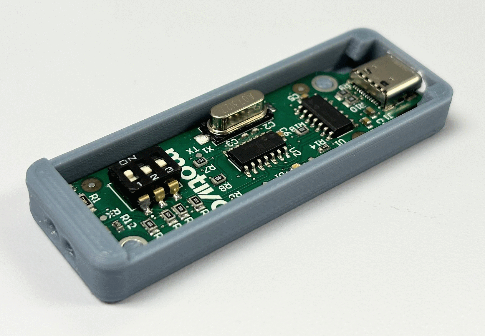


# Dive-IrDA
A USB-to-IrDA transceiver intended for use with some Cressi dive computers.

## General Description

This project arose due to the extreme difficulty in finding and purchasing Cressi's official Bluetooth/USB transceiver interface for the "big screen" dive computers for a reasonable amount of money. In small quantities (~10), we have been able to produce devices for around $30 USD each.

This device uses all off-the-shelf parts to form a serial transceiver between a USB port and an IrDA transceiver module capable of 115200 baud. It does this in a chain of three ICs:

- MCP2221A: USB to UART transceiver
- MCP2120T: UART to IrDA encoder-decoder
- TFBS4650: IR photodiode-emitter pair with internal driver

The above creates a device that should work as a generic IrDA transceiver, though it has only been tested or its intended use: with specific Cressi dive computers. See below section for dive computer model compatibility. 
 
## License

This repository and its design files are licensed under **CERN-OHL-S**, also known as _CERN Open Hardware Licence Version 2 - Strongly Reciprocal._ The following intents are imparted by this license:

 - The design is modifiable and distributable as long as attribution and source is provided downstream.
 -  You may manufacture and sell devices based on this original design or a modification of it, as long as attribution and source is provided downstream. 
 - We assume no liability and provide no warranty for the functionality of the design.
 - You may **not** take or repackage this design and sell it as digital design package. All distributions must contain and carry out the intent of the license.  

## Compatibility

In our **limited** testing with the [Subsurface](https://subsurface-divelog.org/) open source dive logging application, we have so far discovered these compatibilities:
| Manufacturer | Model | Works? | Notes |
|--|--|--|--|
| Cressi | Giotto (presumably "1.0") | ✅ | Tested on Linux (Ubuntu 22), MacOS (13), Windows (10, 11)
| Cressi | Leonardo (presumably "1.0") | ✅ | Tested on Linux (Ubuntu 22), MacOS (13, 14), Windows (10, 11)
| Cressi | Donatello 2.0 | ❓ | Will likely work in the future, [ongoing work here](https://github.com/subsurface/libdc/issues/67).
| Cressi | Michelangelo | ❓ | Might work, given similarity to other computers
| Galileo | Sol | ❌ | Subsurface only supports native IrDA adapters for the Galileo Sol, not IrDA-to-USB-Serial devices like ours.

At this time, the common OEM dive log downloader apps do not work with our device. We don't intend on supporting these apps in the future, but encourage others to fork this project or concepts from it to create compatibility with other dive computers!

## Source Files

This repo contains the original source files for Altium (PCB design) and Solidworks (3D printed enclosure design). It also contains files for manufacturing the PCBA (Gerbers and drills, bill of materials, pick-and-place). 

## Usage

We have written a very basic "quick start" manual which can be found [here](USB%20to%20IRDA%20Kit%20User%20Guide.pdf).

Initial discussion about the device began [here](https://groups.google.com/g/subsurface-divelog/c/ku56SSlCtZU/m/znZ3TwYTBwAJ).

## Thanks
Project development was undertaken by Teddy Huffer (electrical and mechanical design) and Daniel Samarin (architecture, concept of operation) while working at [Motivo](https://www.motivo.com/). Motivo sponsored the time and materials for this project.

Also thanks to our beta testers that contributed their time and money (for shipping costs) to testing our device with their dive computers: Chris, Katherine, Charles, Ivar, Robert, Anthony, Yann.
